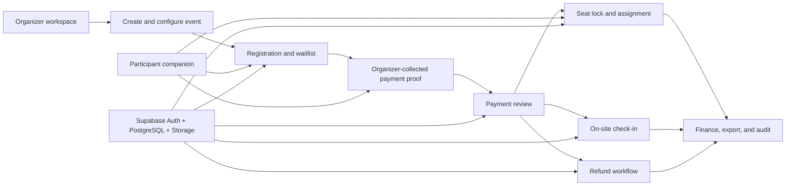

# GatherUp

[](https://github.com/moirakk/GatherUp/actions/workflows/ci.yml)
[](https://nextjs.org/)
[](https://www.typescriptlang.org/)
[](https://supabase.com/)

GatherUp is an organizer-first operations system for small offline community events.

It gives organizers one workspace for event setup, participant registration, organizer-collected payment proof review, seating, notifications, check-in, refunds, finance, and operational audit history. Participant-facing pages support that workflow; GatherUp is not primarily an event promotion or discovery product.

> **Development status:** pre-commercial v0.1. Core database and permission foundations are implemented and under real Supabase validation. The project is not production-ready.

## Product Scope

### Organizer workspace

- Create and configure free or paid events.
- Manage collaborators through explicit event roles and permissions.
- Review organizer-collected payment proofs.
- Operate registration, waitlist, seating, check-in, refund, and finance workflows.
- Publish in-app announcements and inspect an audit timeline.
- Export operational and finance data within permission boundaries.

### Participant companion

- Open a shared event page and register with a verified account.
- Upload payment proof to private Storage.
- Follow order, seat, check-in, notification, and refund status.

### Platform controls

- Review paid-event organizer verification and sensitive event changes.
- Enforce Supabase Auth, PostgreSQL RLS, private Storage policies, and audited RPC transitions.

## Workflow



## Engineering Architecture

GatherUp uses database-first transaction boundaries for operations where partial writes or race conditions would create financial or operational risk.

```text
Browser / Server Components
            |
            v
Next.js Route Handlers + Supabase SSR session validation
            |
            v
PostgreSQL RPCs -------- private Supabase Storage
            |                         |
            v                         v
state transitions, RLS, permissions, audit logs
```

Key design rules:

- Supabase identity is verified from JWT or SSR session cookies; prototype cookies are not authorization sources.
- Registration, payment review, seat locking, check-in, refunds, and collaborator changes use transactional PostgreSQL RPCs where needed.
- Sensitive evidence files live in private, path-constrained Storage buckets.
- Mutating API routes use shared authentication and rate-limiting helpers.
- Contract tests scan API, schema, migration, Storage, and workflow boundaries to catch regressions.
- Mock data is limited to unconfigured local development or explicit demo mode.

## Repository Layout

```text
GatherUp/
|-- src/
|   |-- app/                 Next.js pages, layouts, and API routes
|   |-- components/          Shared product and workflow components
|   `-- lib/                 Auth, Supabase, data, and domain helpers
|-- supabase/
|   |-- migrations/          Versioned database changes
|   |-- validation/          Read-only and post-execution checks
|   |-- schema.sql           Frozen commercial v0.1 schema baseline
|   `-- storage.sql          Private bucket and RLS policy baseline
|-- tests/
|   `-- integration/rpc/     Opt-in real Supabase integration tests
|-- docs/                    Product decisions, architecture, and runbooks
`-- .github/                 CI, issue forms, and pull request template
```

## Current State

| Area | State |
| --- | --- |
| Supabase Auth and SSR session foundation | Implemented |
| Event, registration, payment, seating, check-in, refund schema | Implemented |
| Transactional RPC and RLS baseline | Implemented and contract-tested |
| Private proof Storage policies | Implemented with opt-in integration coverage |
| Organizer and participant workflow wiring | In progress |
| External delivery channels such as email, SMS, and WeChat | Planned |
| Production operations, monitoring, and retention jobs | Not ready |
| Final organizer UI system | In redesign; repository screenshots intentionally withheld |

Detailed and dated progress belongs in [Current project state](./docs/current-state-v0.1.md), not in this README.

## Quality Bar

Every core workflow should be delivered in this order:

1. Confirm the business rule and allowed state transitions.
2. Define the data model, permissions, RLS, and audit requirements.
3. Implement the server or transactional RPC boundary.
4. Connect the UI to the verified data path.
5. Add focused contract and integration coverage.
6. Validate high-risk behavior against a clean Supabase project.

Run the local quality gates:

```bash
npm test
npm run verify
npm run build
git diff --check
```

Real Supabase integration tests are opt-in and must only target an isolated development or staging project:

```bash
GATHERUP_RUN_RPC_INTEGRATION=1 \
GATHERUP_RPC_INTEGRATION_TARGET=clean-dev \
GATHERUP_RPC_INTEGRATION_ALLOWED_REF=<clean-dev-project-ref> \
npm run test:integration:rpc
```

## Local Development

Requirements: Node.js 22 and npm.

```bash
npm install
npm run dev:webpack -- --hostname 127.0.0.1 --port 3000
```

Open `http://127.0.0.1:3000`.

Copy `.env.example` to `.env.local` for Supabase-backed development. Never expose or commit a service-role key. Without Supabase configuration, the app can use its local demo mode for interface development.

## Documentation

- [Documentation index](./docs/index-v0.1.md)
- [Current project state](./docs/current-state-v0.1.md)
- [Commercial v0.1 PRD](./docs/commercial-v0.1-prd.md)
- [Product operating map](./docs/product-operating-map-v0.1.md)
- [Project architecture brief](./docs/project-architecture-brief-v0.1.md)
- [Service-layer contract](./docs/service-layer-contract-v0.1.md)
- [Supabase execution runbook](./docs/supabase-sql-execution-runbook-v0.1.md)
- [RPC integration testing guide](./docs/rpc-integration-testing-v0.1.md)
- [Contributing guide](./CONTRIBUTING.md)
- [Security policy](./SECURITY.md)

## Repository Policy

GatherUp is public for review and collaboration, but it is not an open-source project at this stage. Contributions should be coordinated with the repository owner before implementation. See [LICENSE.md](./LICENSE.md), [CONTRIBUTING.md](./CONTRIBUTING.md), and [SECURITY.md](./SECURITY.md).
