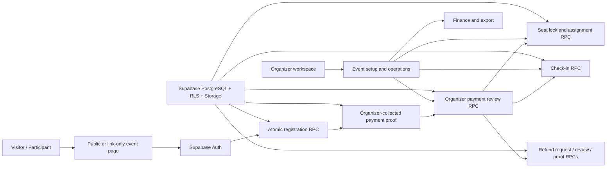

# GatherUp

[](https://nextjs.org/)
[](https://www.typescriptlang.org/)
[](https://supabase.com/)
[](https://github.com/moirakk/GatherUp/actions/workflows/ci.yml)
[](#quality-bar)

GatherUp is a commercial v0.1 event operations platform for small offline community activities.

The first priority scenario is fandom/community activity operations: offline screenings, birthday cafes, small fan gatherings, and similar events where organizers need to manage registration, organizer-collected payment proofs, seat selection, notifications, check-in, finance, and exports in one place.

GatherUp is designed as a general offline event platform, not a fandom-only tool. The model keeps activity scene, workflow template, visibility, payment, registration, seating, check-in, finance, and venue intelligence separate so the product can later support campus events, workshops, small conferences, private gatherings, and markets.

## At A Glance

- Product: offline community event operations, starting with fandom/community activities.
- Core users: organizers, participants, event staff, finance/refund reviewers, and future platform admins.
- Core workflows: event setup, registration, organizer-collected payment proof, review, seating, check-in, refund tracking, finance, and export.
- Current engineering stage: commercial v0.1 Supabase integration, with the core participant, organizer, finance, notification, and proof-file workflows moving from prototype state into verified database-backed paths.
- Reliability direction: PostgreSQL RPCs for atomic state changes, Supabase RLS/Storage for access boundaries, and contract tests to prevent accidental regression.

## Repository

- GitHub: [github.com/moirakk/GatherUp](https://github.com/moirakk/GatherUp)
- Current branch: `main`
- Current stage: commercial v0.1 foundation, now wiring verified Supabase-backed workflows through participant and organizer UI surfaces.
- License: proprietary / all rights reserved during pre-commercial development.

## Product Preview

The screenshots below are generated from the local Next.js app and committed as repository assets.

| Account and Auth Foundation | Public Event Detail |
| --- | --- |
|  |  |

## Product Architecture Snapshot



## Directory Snapshot

```text
GatherUp/
├── src/
│   ├── app/                         Next.js App Router pages and API routes
│   │   ├── api/                     Authenticated workflow endpoints
│   │   ├── events/                  Public event detail and registration flows
│   │   ├── me/                      Participant profile and order detail
│   │   ├── organizer/               Organizer workspace and event console
│   │   └── venues/                  Venue intelligence prototype
│   ├── components/                  Shared UI and workflow components
│   └── lib/                         Auth, data access, Supabase, and server helpers
├── supabase/
│   ├── schema.sql                   Commercial v0.1 database schema and RPCs
│   ├── seed.sql                     Demo seed data
│   ├── storage.sql                  Private Storage buckets and policies
│   └── validation/                  Copy-ready SQL validation scripts
├── tests/
│   └── integration/rpc/             Opt-in real Supabase RPC integration tests
├── docs/                            Product, architecture, runbooks, and status docs
└── prototype/                       Earlier reference/prototype artifacts
```

## Status

Current status: **commercial v0.1 foundation with a passing real Supabase RPC and private Storage RLS validation baseline, plus the first real Supabase-backed participant, organizer, finance, and admin workspaces**. Public event reads, event detail, registration order creation, participant order lists/details, organizer dashboard, organizer event operations, finance center, expense logging, announcement publishing, admin review queues, payment review, check-in, refunds, seat-lock concurrency, and sensitive proof-file access boundaries now have verified backend paths or UI wiring.

Implemented prototype coverage:

- Next.js App Router, TypeScript, React, global CSS.
- Unified account prototype: one account can participate in events and organize events.
- Login/register/code/reset UI with Supabase Auth adapter preparation.
- Activity square, event detail, registration flow, order detail, profile center.
- Organizer workspace, event creation wizard, event management console, finance center.
- Organizer workflow stepper and dynamic next-action guidance for the main organizer workspace and per-event management console.
- Local event draft saving, publish readiness checks, and local created event records.
- Organizer promotion center, notification center, payment review prototype, seat management prototype.
- Venue intelligence prototype.
- Supabase client dependency, Auth adapter, user profile sync adapter, schema/seed/Storage SQL drafts, and contract tests.
- Server-side Supabase read adapters for public event listing, public/link-only event detail, participant orders, organizer dashboard, organizer event workspaces, and organizer finance views. Mock data is now limited to unconfigured local prototype mode or explicit `NEXT_PUBLIC_GATHERUP_DEMO_MODE=1`; configured Supabase failures surface as empty/not-found states with `[gatherup:data]` logs instead of silently showing fake data.
- Initial guarded server APIs for event creation, registration orders, payment review, check-in verification, and Excel exports.
- Event creation wizard now uses the authenticated `/api/events` path as the primary create action when Supabase is configured; local created-event records are retained only as demo fallback when Supabase is unavailable.
- Organizer-sensitive APIs now use a shared Supabase auth helper that accepts verified Bearer tokens for API clients and Supabase SSR session cookies for same-origin browser requests; they no longer trust local prototype cookies.
- Route protection now uses Supabase SSR middleware with verified `getUser()` session checks and cookie refresh support when Supabase is configured.
- Atomic registration RPC draft for real Supabase order creation: user identity is resolved in PostgreSQL through `current_app_user_id()`, event capacity is checked under an event-row lock, order numbers are generated through `event_order_counters`, attendee and payment stub rows are created in the same database transaction path.
- Participant registration order creation now calls the atomic RPC through an authenticated Supabase client. Paid orders return the generated registration and payment identifiers needed for Storage-backed payment proof submission.
- Payment proof submission now has a real private Storage-backed path: the browser uploads to the `payment-proofs` bucket under `{event_id}/{registration_id}/{payment_id}/{filename}`, then a JWT-protected API records the proof and moves the order into payment review.
- Refund proof submission now has a private Storage-backed path: refund managers upload transfer proof to `refund-proofs` under `{event_id}/{refund_request_id}/{filename}`, then a JWT-protected API records the proof through an audited RPC and moves the refund to proof uploaded.
- Seat locking now has PostgreSQL RPCs plus JWT API entry points for expiring stale locks, creating active locks, and confirming assignments under database constraints. The order detail page has an initial real seat-selection panel, and live Supabase concurrency validation now covers competing seat locks.
- Check-in verification now has an audited PostgreSQL RPC path: event staff submit a check-in code through the JWT API, and the database updates the order, attendees, `check_ins`, and `audit_logs` together.
- Organizer announcements now publish through a Supabase-authenticated API route into the `announcements` table; the UI still treats external delivery such as email, SMS, or WeChat as a later channel layer.
- Organizer event consoles can now edit core event basics through an authenticated edit-permission API route, including name, city, venue, address, capacity, start time, registration deadline, and description. Capacity edits are blocked if they would fall below the current active registration count.
- Post-open sensitive event edits now trigger platform review: when an event is already in registration/payment/seat/ready stages, changes to city, venue, address, time, deadline, or capacity mark `events.review_status` as `pending` and create an `event` review request for the admin queue.
- Organizer event consoles can now add, remove, or adjust non-owner collaborators by GatherUp ID through an authenticated API route backed by `manage_event_organizer_atomic`. The database RPC verifies edit permission, performs controlled user lookup, updates `event_organizers`, protects owners, and records collaborator changes in `audit_logs` in the same transactional path.
- Organizer event consoles now surface a read-only audit timeline from `audit_logs`, so collaborator changes, payment review, refund, waitlist, and check-in operations have visible operational traceability instead of staying hidden in the database.
- Organizer event consoles can now open registration through an authenticated edit-permission API route that advances eligible draft/scheduled events to `registration_open`.
- The registration-open API now enforces minimum paid-event and platform-review gates: events with a price or organizer payment QR code require the event owner to have `light_verified` or `enhanced_verified` organizer verification and no forced re-review flag, and events with pending/rejected/suspended platform review status cannot open paid registration.
- The organizer workspace now includes a Supabase-backed organizer verification application panel. Organizers can view their verification status and submit or update pending verification details before attempting to publish paid events.
- The first admin review surface is now available at `/admin`: platform admins can review organizer verification applications and event review requests, approve, reject, suspend, request event changes, and write audit logs for those decisions.
- Organizer finance export now requires finance-level event permission instead of broad event-management permission.
- Organizer finance expenses can now be created through a Supabase-authenticated, finance-scoped API route and stored in `event_expenses`; optional expense proof upload writes to the private `expense-proofs` bucket and updates `event_expenses.proof_url`, and finance managers can soft-void the current proof without deleting the private Storage object. Proof upload and void actions now also write `audit_logs` entries with before/after proof paths.
- Supabase SSR middleware login redirect foundation and safe internal `next` path handling.
- Real Supabase live project preflight, read-only coverage audit logs, and clean dev/staging schema, seed, and Storage execution notes.

Not production-ready yet:

- Several important surfaces are now backed by Supabase. Mock/local fallback paths remain for local demos and explicit demo mode only; configured Supabase deployments no longer hide query failures behind mock content.
- Real write APIs are still early product-integration endpoints, but their core database paths have passed the clean Supabase validation baseline: registration creation, payment proof upload, payment review, check-in, refund request/review/proof upload, seat-lock concurrency, announcement publishing, and private proof-file RLS.
- Venue intelligence, complaints/platform settings, external notification delivery, and some edge-case UI flows are not yet fully backed by production-grade database services. The next risk is less about SQL/RPC correctness and more about finishing end-to-end product journeys on top of the verified backend paths.
- Mutating API routes now share an async rate limiter and a contract test that blocks new write endpoints without rate limiting. When `SUPABASE_SERVICE_ROLE_KEY` is configured, rate-limit counters are stored through the service-role-only `consume_rate_limit` Postgres RPC so limits hold across serverless instances; local/dev environments fall back to the in-memory limiter.
- Supabase schema, seed, Storage policy, and validation scripts have been rebuilt in the clean dev/staging project `oxbrxkllftyevlzmiydt`; the live integration suite now passes 19/19 tests against that project. `supabase/migrations/` now contains the frozen schema/storage baseline plus the API rate-limit RPC migration.
- Anonymous public-read grants for public event detail surfaces are included in the schema draft and local contract tests, and the clean validation project has passed the post-execution SQL summary plus RPC/Storage integration suite.
- Permission enforcement and RLS still need to expand as new product workflows are added, but the commercial v0.1 registration/payment/check-in/refund/seat-lock/proof-file baseline is no longer unvalidated.
- Broader transactional service functions, email business notifications, richer admin review surfaces beyond organizer/event review, collaborator invite-acceptance, expense proof RPC/export evidence hardening, venue review flows, complaints, and data retention jobs are still planned.

## Commercial v0.1 Direction

Commercial v0.1 is not a UI-only milestone. It must become a reliable workflow product with real data, explicit permissions, and auditability.

The target workflow:

1. Organizer becomes eligible to create paid events.
2. Organizer creates and publishes an event.
3. Participant views the shared event page.
4. Participant logs in and registers.
5. System creates an order and temporarily holds capacity.
6. Participant pays the organizer directly through organizer-configured WeChat/Alipay collection information.
7. Participant uploads payment proof.
8. Organizer reviews payment proof.
9. Participant selects seats when eligible.
10. Organizer sends notifications, manages attendees, and checks participants in onsite.
11. Organizer handles refunds, finance, and export when needed.
12. Platform admin can review, configure, audit, and intervene.

Important confirmed decisions:

- First scenario: fandom/community activities.
- Early payment model: organizer-collected payment, not platform-held funds.
- Future extension: platform-collected payments can be added later.
- Paid activities require organizer verification.
- All users can create free activities.
- New events default to link-only visibility.
- Linked event detail can be viewed before login, but registration/payment/order actions require login.
- GatherUp ID remains the public user identifier.
- Seat selection uses temporary locks.
- Refund tracking, lightweight check-in, notifications, export, finance, complaints, admin review, and audit logs are part of the commercial v0.1 scope.

## Tech Stack

- Next.js App Router
- React
- TypeScript
- Supabase JavaScript client
- Supabase Auth, PostgreSQL, and Storage as planned backend foundation
- lucide-react icons
- Global CSS design tokens

## Quality Bar

GatherUp is intentionally being moved from a prototype into a reliable product foundation. Current quality gates include:

- Static contract tests for auth rules, route protection, schema structure, seed data, Storage policy shape, and API/RPC wiring.
- GitHub Actions CI for push and pull request verification.
- Domain status-machine tests for registration, payment, refund, and check-in workflows, aligned with Supabase enum values.
- Workflow event contract tests that derive audit actions, notification types, audiences, and risk levels from valid status transitions.
- Notification queue contract tests that turn workflow events into channel-aware notification items without sending external messages yet.
- Notification delivery schema contract that keeps queued message content, template keys, and metadata persistable in Supabase.
- In-app notification API contract for authenticated reads and RPC-scoped read-state updates.
- Shared notification bell UI for Supabase sessions, backed by the in-app notification API.
- Shared server rate limiting is enforced on all mutating API routes, with an API contract test that scans every `POST`, `PATCH`, `PUT`, and `DELETE` route for `enforceRateLimit(request)`.
- Registration creation RPC writes participant in-app notifications for payment or confirmation next steps.
- Payment proof submission trigger writes in-app review notifications for event payment managers.
- Payment review RPC writes participant in-app notifications in the same transaction as approval/rejection state changes.
- Seat assignment RPC writes participant in-app notifications after a seat is confirmed.
- Check-in RPC writes participant in-app notifications after onsite check-in succeeds.
- Refund request RPC writes in-app review notifications for event refund managers.
- Refund review RPC writes participant in-app notifications when refund requests are approved or rejected.
- Refund proof upload RPC writes participant in-app notifications after transfer proof is recorded.
- Opt-in real Supabase RPC integration tests for registration creation, duplicate protection, capacity contention, payment review, check-in, refund request/review/proof upload, concurrent payment/check-in/seat races, and private Storage proof access including cross-user path isolation, post-confirmation upload denial, malformed path denial, and proof immutability.
- Database-first transactional design for sensitive workflows: registration, payment review, seat locking, check-in, and refunds are represented as PostgreSQL RPC paths rather than loose client-side state changes.
- Supabase SSR middleware and Bearer-token API support so browser sessions and external API calls share the same verified identity model.
- API route authentication is guarded by a directory-scanning contract test: every `src/app/api/**/route.ts` file must call the shared Supabase server auth helpers inside the handler because middleware intentionally lets `/api` requests reach route-level authorization.
- Private Storage path contracts for sensitive proof files, including payment proofs and refund proofs, with integration coverage for owner/manager reads, participant upload boundaries, refund-role separation, malformed paths, and no update/delete policies.
- Documentation-first runbooks for clean Supabase project execution, validation logging, and future service-layer expansion.
- Organizer audit timeline contract coverage ensures the event workspace continues to read `audit_logs` and render before/after snapshots, action labels, and risk levels for sensitive operations.
- Supabase migration contract tests keep the frozen `schema.sql` and `storage.sql` baselines aligned with `supabase/migrations/`, and verify the service-role-only boundary for the API rate-limit table/RPC.

Current local verification:

```bash
npm test
npm run verify
npm run typecheck
npm run build
```

Opt-in live Supabase verification:

```bash
GATHERUP_RUN_RPC_INTEGRATION=1 GATHERUP_RPC_INTEGRATION_TARGET=clean-dev GATHERUP_RPC_INTEGRATION_ALLOWED_REF=<clean-dev-project-ref> npm run test:integration:rpc
```

Latest clean validation result: **19/19 real Supabase RPC and Storage RLS integration tests passed** against `gatherup-commercial-v01-validation` (`oxbrxkllftyevlzmiydt`) on 2026-06-28.

## Local Development

Install dependencies:

```bash
npm install
```

Run the local app:

```bash
npm run dev:webpack -- --hostname 127.0.0.1 --port 3000
```

Open:

```text
http://127.0.0.1:3000
```

Recommended checks:

```bash
npm test
npm run verify
npm run typecheck
npm run build
```

Real Supabase RPC integration checks are opt-in:

```bash
GATHERUP_RUN_RPC_INTEGRATION=1 GATHERUP_RPC_INTEGRATION_TARGET=clean-dev GATHERUP_RPC_INTEGRATION_ALLOWED_REF=<clean-dev-project-ref> npm run test:integration:rpc
```

This requires `NEXT_PUBLIC_SUPABASE_URL`, `NEXT_PUBLIC_SUPABASE_ANON_KEY`, and `SUPABASE_SERVICE_ROLE_KEY`. The test creates isolated temporary Supabase Auth users and events, validates `create_registration_atomic`, `review_payment_atomic`, `check_in_order_atomic`, and the refund request/review/proof-upload RPC chain, then cleans up.

Use the clean dev/staging project service role key only. Do not run the opt-in integration suite against production or a shared live database. The integration runner also checks `GATHERUP_RPC_INTEGRATION_ALLOWED_REF` against the project ref in `NEXT_PUBLIC_SUPABASE_URL`.

The project currently recommends `dev:webpack` for local preview because it has been more stable than Turbopack dev mode in this workspace.

## Demo Account

When Supabase is not configured, the app falls back to local prototype account behavior.

```text
Email: miki@gatherup.local
Password: gatherup123
```

This demo mode is for prototype verification only. It is not a production account system.

## Documentation

Start here:

- [Documentation index](./docs/index-v0.1.md)
- [Project architecture brief](./docs/project-architecture-brief-v0.1.md)
- [Product operating map](./docs/product-operating-map-v0.1.md)
- [Commercial v0.1 PRD](./docs/commercial-v0.1-prd.md)
- [Commercial v0.1 decision log](./docs/decision-log-v0.1.md)
- [Commercial v0.1 engineering plan](./docs/commercial-v0.1-engineering-plan.md)
- [Service-layer contract](./docs/service-layer-contract-v0.1.md)
- [Schema validation checklist](./docs/schema-validation-checklist-v0.1.md)
- [Current project state](./docs/current-state-v0.1.md)
- [GitHub repository profile copy](./docs/github-repository-profile-v0.1.md)
- [Contributing guide](./CONTRIBUTING.md)
- [Security policy](./SECURITY.md)
- [License](./LICENSE.md)

Product and architecture:

- [Product operating map](./docs/product-operating-map-v0.1.md)
- [Commercial v0.1 PRD](./docs/commercial-v0.1-prd.md)
- [Commercial v0.1 decision log](./docs/decision-log-v0.1.md)
- [Commercial v0.1 engineering plan](./docs/commercial-v0.1-engineering-plan.md)
- [Service-layer contract](./docs/service-layer-contract-v0.1.md)

Supabase:

- [SQL draft](./supabase/schema.sql)
- [Seed draft](./supabase/seed.sql)
- [Storage policy draft](./supabase/storage.sql)
- [Copy-ready Supabase validation SQL files](./supabase/validation)
- [Schema validation checklist](./docs/schema-validation-checklist-v0.1.md)
- [Supabase SQL execution runbook](./docs/supabase-sql-execution-runbook-v0.1.md)
- [Clean Supabase validation checklist](./docs/supabase-clean-project-validation-v0.1.md)
- [Supabase live validation log](./docs/supabase-live-validation-log-v0.1.md)
- [RPC integration testing guide](./docs/rpc-integration-testing-v0.1.md)

## Engineering Principles

From this point forward, GatherUp should be developed as a reliable product, not as surface-level prototype work.

Every core feature should be implemented in this order:

1. Confirm business rules.
2. Fix data model and state machine.
3. Define permissions and RLS/service checks.
4. Implement service layer or server action.
5. Connect UI.
6. Add focused tests.
7. Verify with real Supabase behavior where applicable.

## Next Milestones

Recommended order:

1. Wire the passing backend baseline into more complete participant and organizer UI flows: real order states, proof review, check-in, refund proof visibility, and seat selection feedback.
2. Expand the real data service layer beyond the current event creation, basic event editing, collaborator management RPC, and open-registration baseline: invite acceptance, visibility, review gates, and richer post-publish edit constraints.
3. Organizer-collected payment workflow: collection-code versions, review queues, top-up, overpayment/underpayment, and finance reconciliation.
4. Continue refund completion: participant receipt confirmation, disputes, retention policy, and finance export evidence.
5. Build the organizer dashboard metrics layer for pending reviews, check-in rate, refund exposure, seat progress, and revenue.
6. Execute the API rate-limit migration in the clean validation project and add a live RPC integration check for `consume_rate_limit`.

## Repository Notes

Suggested GitHub description, topics, and About copy are documented in:

- [GitHub repository profile copy](./docs/github-repository-profile-v0.1.md)

Repository governance:

- [Contributing guide](./CONTRIBUTING.md)
- [Security policy](./SECURITY.md)
- [License](./LICENSE.md)
- GitHub issue templates for bugs, feature requests, and engineering tasks.
- GitHub pull request template with risk, workflow, verification, and security sections.
