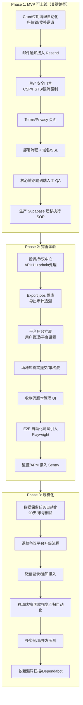

# GatherUp 上线就绪审计与分阶段路线图

Last updated: 2026-07-22

本报告基于以下材料完成：`README.md`、`SECURITY.md`、`CONTRIBUTING.md`、`LICENSE.md`、`docs/` 全部文档（`index-v0.1.md`、`current-state-v0.1.md`、`project-architecture-brief-v0.1.md`、`product-operating-map-v0.1.md`、`commercial-v0.1-prd.md`、`decision-log-v0.1.md`、`commercial-v0.1-engineering-plan.md`、`schema-validation-checklist-v0.1.md`、`service-layer-contract-v0.1.md`、`infra-hardening-2026-07.md`、`supabase-live-validation-log-v0.1.md` 等）、`src/` 全部应用代码（46 个页面/路由、28 个 API route、`src/lib`、`src/domain`）、`supabase/schema.sql`（约 4500 行）、`supabase/storage.sql`、`supabase/migrations/`（3 个文件）、`supabase/validation/`（13 个只读校验脚本）、`tests/`（16 个测试文件）、`.github/workflows/ci.yml`、`.env.example`、`package.json`。

结论先行：GatherUp 是一个**工程严谨、文档先行**的 pre-commercial v0.1 项目。核心数据库层（schema/RLS/审计型 RPC）已在干净 Supabase 项目验证通过，但**产品层收尾（复杂 UI 全流程、投诉中心、场地库真实化）**和**运维层（部署、监控、备份、Cron、邮件）**基本空白，这也是当前并行基建任务（安全门禁、邮件通知、过期清理 RPC、Cron）要补的部分。

---

## 一、项目完成度审计

### 1. 产品/文档层 —— 完成度高

- PRD、决策日志（D001-D058+）、工程计划（Phase 0-10）、服务层契约、schema 校验清单齐全且互相引用一致，`docs/index-v0.1.md` 作为统一入口。
- `docs/current-state-v0.1.md`、`project-architecture-brief-v0.1.md` 明确区分"已实现层"与"目标层"，自我认知诚实，未过度宣称完成度。

### 2. 前端模块（`src/app`，46 个页面/路由）

| 模块                                                                                                                | 状态                                                                        |
| ------------------------------------------------------------------------------------------------------------------- | --------------------------------------------------------------------------- |
| 参与者：活动广场 `/`、详情 `/events/[id]`、报名 `/register`、订单详情 `/me/orders/[orderNumber]`、账号中心 `/me`    | Supabase 真实读取路径已接入，UI 原型完成                                    |
| 组织者：工作台 `/organizer`、创建向导 `/organizer/events/new`、管理台 `/organizer/events/[id]`、财务中心 `/finance` | 真实写入 API 已接入（活动创建、编辑、协作者管理、审计时间线）               |
| 平台后台 `/admin`                                                                                                   | 仅覆盖组织者认证审核 + 活动审核请求；**投诉、平台配置、用户管理均未实现**   |
| 场地库 `/venues`、`/venues/[venueId]`                                                                               | 仍是纯 mock 数据（`src/lib/mock-data.ts`），无 Supabase 读写、无提交/审核流 |
| 登录/引导 `/login`、`/onboarding`                                                                                   | Supabase Auth 已接入，未配置时回退本地原型账号                              |

### 3. API 路由（`src/app/api`，28 个 route.ts）

- 已实现且有审计日志：活动 CRUD/发布、报名订单（原子 RPC）、付款凭证上传/审核、退款申请/审核/凭证/确认/争议、座位锁/确认、核销、候补加入/邀请/转正、协作者管理、组织者认证、平台审核（event-reviews、organizer-verifications）、通知已读、财务支出、财务导出、名单导出。
- **完全缺失**：投诉提交/处理 API（`complaints` 表已建但无任何 route 消费）、场地库提交/审核 API、邮件发送 API/webhook、健康检查端点（`/health` 或 `/api/health` 未找到）。

### 4. 数据库层（`supabase/`）—— 相对最成熟

- `schema.sql`（约 4500 行）含完整枚举、表、RLS policy、触发器，以及 12+ 个审计型 RPC（`create_registration_atomic`、`review_payment_atomic`、`check_in_order_atomic`、`request_refund_atomic` 等全链路）。
- `storage.sql` 定义 8 个私有 bucket（`payment-proofs`、`refund-proofs`、`collection-codes`、`activity-covers`、`activity-materials`、`expense-proofs`、`complaint-evidence`、`exports`），策略均按 `can_manage_event*` helper 函数收紧。
- `supabase/migrations/` 仅 3 个文件（初始 schema 基线、storage 基线、跨实例限流表），治理机制刚从 2026-07-05 建立，历史 DDL 变更尚未完全被迁移化管理覆盖。
- `supabase/validation/` 13 个只读脚本仅用于人工复制进 SQL Editor 执行，**没有自动化执行/CI 集成**。
- 已在干净 dev/staging 项目（`oxbrxkllftyevlzmiydt`）验证 schema+seed+storage 执行成功，RPC/Storage 集成测试 19/19 通过（2026-06-28）。
- **关键缺口**：`export_jobs`、`complaints` 表存在 RLS policy，但应用层完全没有消费路径；过期座位锁/候补邀请的**自动清理任务（cron）不存在**，只有手动触发的 `expire_seat_locks_for_event`。

### 5. 测试覆盖（`tests/`，16 个文件）

- 静态契约测试（schema-contract、migrations-contract、api-contract、auth-rules、docs-links、status-machine、workflow-events、notification-queue、organizer-dashboard-metrics、rate-limit、project-config）覆盖面广，运行快、不依赖网络。
- `tests/integration/rpc/*`（4 个文件：registration、concurrency、rate-limit、storage-proof-access）为 **opt-in** 真实 Supabase 集成测试，默认跳过；最近一次尝试因沙箱网络无法连通 Supabase（`ECONNRESET`/`ENOTFOUND`）未能重新验证（见 `docs/infra-hardening-2026-07.md` 2026-07-16 记录）。
- **完全没有**：组件/页面级单元测试、Playwright/Cypress 等 E2E 测试、视觉回归测试。`package.json` 无 `playwright`/`cypress`/`vitest`/`jest` 依赖。
- `npm run verify` = lint + test + typecheck，CI 里额外跑 `build` 和 `git diff --check`；**CI 中 Supabase 用的是占位符 URL，真实集成测试从不在 CI 里跑**。

### 6. CI/CD（`.github/`）

- 单一 workflow（`ci.yml`）：lint → contract test → typecheck → build → whitespace check，15 分钟超时，仅在 push/PR 到 `main` 触发。
- **没有**：部署 workflow（Vercel/其他）、数据库迁移自动执行、Preview 环境、Dependabot/安全扫描、release 流程。
- Issue/PR 模板齐全（bug/feature/engineering task + PR template）。

### 7. 环境变量（`.env.example`）

- 仅 `NEXT_PUBLIC_SUPABASE_URL`、`NEXT_PUBLIC_SUPABASE_ANON_KEY` 为必需；`SUPABASE_SERVICE_ROLE_KEY`、RPC 集成测试变量、demo mode 开关均为注释掉的 opt-in 项。
- **没有**任何邮件 provider（Resend）、监控（Sentry）、域名/CDN 相关变量占位——因为这些集成尚未开始。

### 8. 安全与合规

- `next.config.ts` 已设置 `X-Frame-Options`、`X-Content-Type-Options`、`Referrer-Policy`、`Permissions-Policy`；**缺少 CSP 和 HSTS**。
- `middleware.ts` 用 `@supabase/ssr` 做页面路由保护 + `getUser()` 会话校验；API 路由各自校验 Bearer/SSR cookie，统一走 `src/lib/server/api.ts` helper。
- 限流：配置 `SUPABASE_SERVICE_ROLE_KEY` 时用 Postgres `consume_rate_limit` RPC 跨实例限流，未配置时退化为内存限流（多实例部署下会漏限流）。
- RLS 覆盖到全部创建的表（有契约测试 `enables RLS on every public table`），敏感 bucket 均为 private。
- **无 Terms of Service / Privacy Policy 页面**（决策日志 D057/D058 提到 90 天留存与账号删除申请规则，但前端无对应页面/入口）。
- License 为 proprietary（非开源），仓库策略是"公开可见但非开源协作"。

---

## 二、差距清单（按维度）

### A. 功能层面（核心流程未完成/未闭环）

1. 场地库（Venues）：仍 100% mock，无提交/审核/持久化。
2. 投诉/争议中心：数据库表 + RLS 已就绪，**应用层零实现**（无提交表单、无 admin 处理 UI、无 API）。
3. 平台后台 `/admin`：缺用户管理、平台设置（低额度审核规则、风控阈值配置）、投诉队列。
4. Export jobs：`export_jobs` 表存在但当前导出 API（`/api/export/finance`、`/api/export/attendees`）直接生成 Excel 返回，**未写入 `export_jobs` 记录**，无导出历史/审计追溯。
5. 候补邀请过期、退款争议平台升级处理：文档标注为"第三优先级"，未实现。
6. 收款码版本管理 UI：数据模型存在（`collection_code_versions`），缺完整前端管理界面。
7. 端到端 UI 级验收：报名→付款→审核→选座→核销→退款全链路只验证到 RPC/API 层，未做完整用户视角走查。

### B. 基建层面

1. **邮件通知**：架构预留（`src/domain/notification-queue.ts` 有 `toNotificationDeliveryInsert()`），但 Resend（或任何 provider）**尚未接入**，`notification_deliveries` 只有站内 channel 生效。
2. **支付**：v0.1 明确设计为"组织者自收款 + 平台不代收"，无需接入支付网关，这是既定产品决策而非缺口。
3. **文件存储**：Supabase Storage 私有 bucket 已就绪，缺失的是过期文件清理任务和 `exports` bucket 的实际消费路径。
4. **监控/日志**：无 Sentry/Datadog 等 APM，仅有 `[gatherup:data]` 结构化 console 日志约定；无 `/health` 健康检查端点；无告警机制。
5. **Cron/定时任务**：`expire_seat_locks_for_event` 等过期清理函数只能被动调用（依赖用户操作触发），无 Supabase Cron/pg_cron/Edge Function 定时触发。这正是背景提到"并行任务正在做"的部分。

### C. 安全层面

1. CSP、HSTS 头未配置（当前只有 4 个基础安全头）。
2. 跨实例限流依赖 `SUPABASE_SERVICE_ROLE_KEY`，未配置时多实例部署会退化为单实例内存限流，生产环境必须强制配置。
3. 真实 Supabase RPC/Storage 集成测试从未在 CI 中自动运行，仅本地 opt-in，且最近一次因网络问题未能重新验证。
4. 无自动化依赖漏洞扫描（Dependabot/`npm audit` 未见于 CI）。
5. 无 CSRF 显式防护记录（依赖 SameSite cookie + Bearer token 模式，需确认 SSR cookie 路径的 SameSite 策略）。
6. Terms of Service / Privacy Policy 页面缺失——对公开可见、涉及支付凭证等敏感信息的产品是合规必需项。

### D. 运维层面

1. 无任何部署 workflow（Vercel/Docker/其他），`.github/workflows/` 只有 CI 验证。
2. 数据库迁移策略刚建立（2026-07-05 起 3 个迁移文件），历史 DDL 靠 `schema.sql` 冻结基线，**缺少针对 clean-dev 项目之外（如 staging/prod）的迁移执行 SOP 自动化**。
3. 无备份策略文档（依赖 Supabase 托管备份，但项目文档未记录 RPO/RTO 目标或验证过恢复流程）。
4. 无域名/SSL 相关配置（项目尚未部署，`README` 承认"repository screenshots intentionally withheld"）。
5. `supabase/validation/*.sql` 13 个脚本仍是"人工复制进 SQL Editor 执行"模式，未纳入任何自动化 pipeline。

### E. 测试层面

1. 单元测试：仅 `src/domain/*` 有对应契约测试，`src/lib`（server/api、rate-limit、excel 等）覆盖有限。
2. 集成测试：4 个 opt-in RPC 测试覆盖注册/并发/限流/Storage，良好但非 CI 常态化。
3. E2E 测试：**完全空白**，无 Playwright/Cypress，无法自动验证真实浏览器交互（登录态刷新、路由保护、表单提交等在文档里反复强调"需要人工验证"）。
4. 移动端/桌面端视觉回归：仅人工验收记录（390px 预览），无自动化快照测试。

---

## 三、分阶段上线路线图

### Phase 1：MVP 可上线（关键路径，阻塞上线）

| 任务                                                                                                               | 工作量估算 | 依赖                                                                                             |
| ------------------------------------------------------------------------------------------------------------------ | ---------- | ------------------------------------------------------------------------------------------------ |
| 座位锁/候补邀请过期清理任务自动化（pg_cron 或 Supabase Edge Function + Cron）                                      | 中         | 现有 `expire_seat_locks_for_event` RPC 已就绪，只需接调度器                                      |
| 邮件通知接入 Resend（站内通知→邮件 channel 落地）                                                                  | 中         | `notification_queue.ts` 契约已就绪，需新增 provider adapter + `notification_deliveries` 状态回写 |
| 生产安全门禁：CSP/HSTS 头补齐、强制 `SUPABASE_SERVICE_ROLE_KEY` 配置（跨实例限流）、`npm audit`/Dependabot 接入 CI | 小-中      | 无强依赖，可并行                                                                                 |
| Terms of Service / Privacy Policy 页面 + 账号删除申请入口（对齐 D057/D058）                                        | 小         | 无强依赖                                                                                         |
| 部署流程（Vercel 或其他）+ 域名/SSL + 生产环境变量清单固化                                                         | 中         | 需先确定托管平台                                                                                 |
| 核心链路（报名→付款→审核→选座→核销→退款）端到端人工 QA，覆盖桌面+移动                                              | 中-大      | 依赖以上基建就绪                                                                                 |
| 生产 Supabase 项目的 migrations 执行 SOP（区别于当前 clean-dev 验证项目），含回滚预案                              | 中         | 依赖迁移治理机制已存在（`supabase/migrations/`）                                                 |

**关键路径**：Cron 清理 → 邮件通知 → 安全门禁 → 端到端 QA → 生产迁移执行 → 上线。这五项之间大体可并行推进（除端到端 QA 需等主要基建就绪），且背景提到的"并行任务"（安全门禁/邮件/过期清理/Cron）正是本 Phase 的全部内容，建议作为唯一上线前置条件集中攻坚。

### Phase 2：完善体验

| 任务                                                                  | 工作量估算 | 依赖                                                    |
| --------------------------------------------------------------------- | ---------- | ------------------------------------------------------- |
| 投诉/争议中心完整闭环（提交 API + 参与者/组织者 UI + admin 处理面板） | 中-大      | `complaints` 表/RLS 已就绪                              |
| Export jobs 落库改造，导出历史可追溯、审计留痕                        | 小-中      | `export_jobs` 表已就绪，改造现有导出 API                |
| `/admin` 后台扩展：用户管理、平台配置（风控阈值、审核规则可视化配置） | 中-大      | 依赖 Phase 1 admin 审核基础                             |
| 场地库从 mock 迁移为真实提交/组织者提交/平台审核后进入公共库          | 中         | 无强依赖，可独立推进                                    |
| 收款码版本管理完整 UI（当前仅数据模型）                               | 小-中      | 无强依赖                                                |
| 引入 Playwright E2E 自动化测试，覆盖核心用户旅程                      | 中-大      | 建议在 Phase 1 端到端 QA 之后，把人工验收步骤自动化固化 |
| 接入 Sentry 等 APM + 结构化日志聚合 + `/health` 健康检查端点          | 小-中      | 无强依赖                                                |

### Phase 3：规模化

| 任务                                                                         | 工作量估算 | 依赖                                       |
| ---------------------------------------------------------------------------- | ---------- | ------------------------------------------ |
| 数据保留自动化任务（90 天付款截图留存到期清理、账号删除申请批处理）          | 中         | 依赖 Phase 1 Cron 基建复用                 |
| 退款争议平台升级处理流程（当前只有主办处理，无平台介入路径）                 | 中         | 依赖 Phase 2 投诉中心基础设施复用          |
| 微信登录 + 微信通知 channel 接入（当前预留数据模型和入口）                   | 大         | 依赖微信企业资质/API 申请，属外部依赖      |
| 移动端/桌面端视觉回归自动化（当前仅人工验收记录）                            | 中         | 依赖 Phase 2 E2E 框架已引入                |
| 多实例部署下的高并发/超卖压测（验证座位锁、限流 RPC 在真实多实例场景的表现） | 中-大      | 依赖生产环境已部署                         |
| 依赖漏洞扫描常态化、SLA/备份恢复演练                                         | 小-中      | 无强依赖，建议尽早启动但优先级低于功能闭环 |

---

## 参考文档索引

- [文档索引](./index-v0.1.md)
- [当前项目总览](./current-state-v0.1.md)
- [项目架构简报](./project-architecture-brief-v0.1.md)
- [商业化 v0.1 PRD](./commercial-v0.1-prd.md)
- [商业化 v0.1 决策日志](./decision-log-v0.1.md)
- [商业化 v0.1 工程计划](./commercial-v0.1-engineering-plan.md)
- [服务层契约](./service-layer-contract-v0.1.md)
- [Schema 校验清单](./schema-validation-checklist-v0.1.md)
- [基建加固记录（2026-07）](./infra-hardening-2026-07.md)
