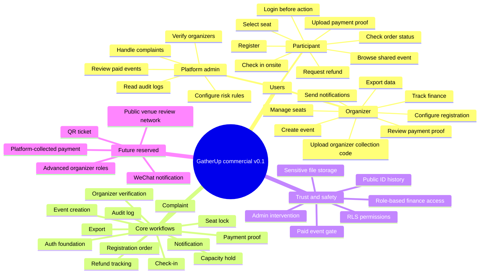

# GatherUp commercial v0.1 product operating map

Last updated: 2026-06-02

This document is the shared product map for GatherUp commercial v0.1. It is meant to answer one question clearly: what are we building, what must be real, and what is still only reserved for later.

## 1. One Sentence

GatherUp helps small offline community organizers run paid or free events with real registration, organizer-collected payment proof review, seat selection, check-in, finance, notifications, exports, complaints, and admin auditability.

## 2. Product Map

## 3. Confirmed Product Decisions

| Area | Decision |
| --- | --- |
| First scenario | Fandom/community offline events: screenings, birthday cafes, fan gatherings. |
| Product boundary | Not fandom-only. The model must later support campus events, workshops, small conferences, private gatherings, and markets. |
| Account model | One account can participate and organize. No separate participant/organizer account type. |
| Public user identity | GatherUp ID is the public identifier. Nicknames may repeat. GatherUp ID can be changed at most 2 times. |
| Login gate | Shared event detail can be viewed before login. Registration, payment, order, refund, complaint, and organizer actions require login. |
| Early payment model | Organizer collects money directly. GatherUp records collection code versions, payment proofs, review state, top-ups, refunds, and finance. |
| Platform payment | Reserved for future. v0.1 does not hold funds. |
| Paid event gate | Paid events require organizer verification and may require platform review. Free events can be created by ordinary users. |
| Event visibility | New events default to link-only/unlisted, not public square listing. |
| Payment proof access | Owner and finance can view by default. Cohost needs explicit permission. Staff/viewer cannot view by default. |
| Seat selection | Payment must be confirmed first when event requires paid-before-seat. Seat locks prevent duplicate selection. |
| Admin scope | v0.1 needs minimum admin: verification, event review, platform settings, complaints, and audit logs. |

## 4. What Must Be Real In v0.1

These parts cannot remain surface UI:

- Supabase Auth session and GatherUp profile sync.
- `users`, `user_auth_identities`, and `user_public_id_history`.
- Organizer verification and paid-event eligibility.
- Event creation, organizer roles, visibility, capacity, and review state.
- Registration order creation with unique order number.
- Capacity hold and expiration.
- Organizer collection code version binding per order.
- Payment proof upload, review, rejection, resubmission, top-up, and overpayment tracking.
- Refund request, organizer decision, refund proof, participant confirmation, and dispute state.
- Seat lock and seat assignment.
- Check-in record.
- Notification delivery record.
- Finance summary and export job.
- Complaint record.
- Admin user and audit logs.
- RLS and Storage policies for sensitive data.

## 5. Current Implementation State

| Layer | Status | Notes |
| --- | --- | --- |
| Frontend shell | In progress | Middleware protects private routes and allows public event detail. |
| Login page | In progress | Supabase session can recreate GatherUp cookie session when configured. |
| Profile sync | In progress | Supabase Auth user id is the durable identity anchor. |
| Dev status page | In progress | Checks cookie session, Supabase Auth session, profile sync, and commercial schema table existence. |
| Commercial docs | In progress | PRD, decision log, engineering plan, README, schema checklist, and this product map exist. |
| SQL schema draft | In progress | Expanded commercial v0.1 schema draft exists but has not been executed against PostgreSQL in this workspace. |
| Seed data | In progress | Seed reflects commercial enums and organizer-collected payment setup. |
| Storage policies | In progress | Storage bucket and `storage.objects` policy draft exists but has not been executed in Supabase. |
| Service-layer contract | In progress | Required server-side operations and invariants are documented; implementation has not started. |
| Real event services | Not started | Event creation still uses prototype/local behavior. |
| Real registration services | Not started | Orders, capacity holds, waitlist, and attendees are not yet backed by service transactions. |
| Admin backend | Not started | Tables exist in draft; UI/service layer not implemented. |

## 6. Reliability Standard

A workflow is not considered complete until all of these are true:

1. The business rule is written in the PRD or decision log.
2. The state is represented in schema or service code.
3. Permissions are enforced by RLS or server-side checks.
4. Sensitive files use private Storage rules.
5. The UI reads and writes real data in Supabase mode.
6. The operation has a clear audit trail when it touches money, identity, permissions, exports, or complaints.
7. TypeScript checks pass.
8. SQL has been executed against a real PostgreSQL/Supabase environment.
9. The happy path and one failure path have been manually verified.

## 7. Next Build Order

The professional build order from here:

1. Finish Auth foundation.
2. Execute and fix commercial SQL schema in a real Supabase/PostgreSQL environment.
3. Convert schema draft into migrations.
4. Implement organizer verification and minimum admin bootstrap.
5. Implement real event creation and publish gates.
6. Implement registration/order/capacity service transactions.
7. Implement organizer-collected payment proof workflow with private Storage.
8. Implement refunds and finance.
9. Implement seat locks, seat assignment, and check-in.
10. Implement notifications, exports, complaints, audit logs, and readiness checks.

## 8. Current Non-Negotiables

- Do not build payment proof UI without private file access rules.
- Do not expose organizer collection codes to users without payable orders.
- Do not trust frontend-only role checks for finance, proof review, refunds, exports, or admin.
- Do not treat payment as platform-collected money in v0.1.
- Do not allow paid-event publishing without organizer verification gates.
- Do not consider schema ready until it has run successfully outside text review.
- Do not mark a workflow complete if it cannot survive refresh, direct link navigation, and logout/login.
