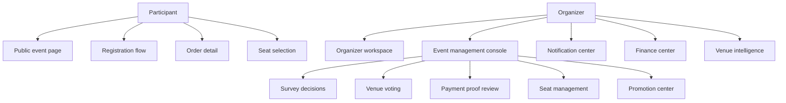
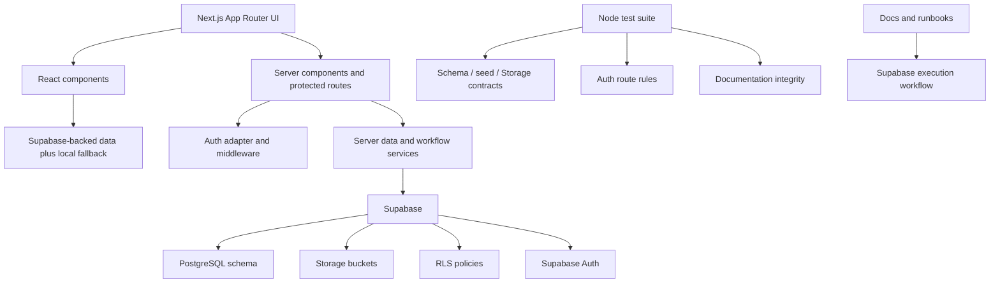
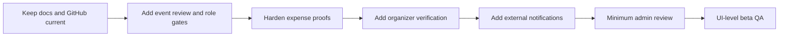

# GatherUp v0.1 project architecture brief

Last updated: 2026-06-29

This brief is written for product and engineering review. It summarizes what GatherUp is, how the current codebase is structured, what has already been validated, and what remains before a reliable commercial v0.1 release.

## 1. One-sentence summary

GatherUp is an offline event operations platform for small community activities, helping organizers manage event setup, registration, organizer-collected payment proof review, seat selection, notifications, finance, venue knowledge, and exports in one workflow.

## 2. Current stage

GatherUp is currently at the **commercial v0.1 foundation stage**:

- The product direction and business rules are documented.
- The Next.js frontend covers the main participant and organizer workflows, with local/mock fallback still retained for demo mode and unavailable Supabase environments.
- The Supabase schema, seed, Storage buckets, and RLS policies exist and have been exercised against a clean validation project.
- Static contract tests verify important SQL, Storage, auth, and documentation assumptions.
- A clean Supabase dev/staging project has run `schema.sql`, `seed.sql`, corrected `storage.sql`, post-execution validation scripts, and the opt-in RPC/Storage integration suite.
- Organizer-sensitive APIs now use shared Supabase auth helpers that accept verified Bearer tokens and same-origin SSR session cookies, while page route protection uses Supabase SSR middleware with `getUser()` session verification and cookie refresh.
- Registration order creation now calls the atomic PostgreSQL RPC through an authenticated Supabase client.
- Public event listing/detail, participant order views, organizer dashboard, organizer event workspace, and organizer finance workspace now have Supabase-backed read paths with local fallback behavior.
- The first private Storage-backed payment-proof path has been added: browser upload to `payment-proofs`, then JWT-protected proof metadata submission.
- Payment review now has an audited PostgreSQL RPC draft wired through the organizer review API.
- Participant refund requests, organizer refund review, and refund proof upload now have audited PostgreSQL RPC drafts wired through JWT APIs.
- Seat locking now has PostgreSQL RPC drafts, JWT API entry points, and an initial order-detail seat selection panel for expiring locks, creating locks, and confirming seat assignments.
- Check-in now has an audited PostgreSQL RPC draft wired through the organizer verification API.
- Organizer announcements now publish through a Supabase-authenticated API route into the `announcements` table, while external delivery channels remain future work.
- The app still has prototype surfaces, especially venue intelligence, admin review, external notification delivery, richer event review transitions/post-publish edit constraints, and expense proof editing/voiding, so the next engineering phase is to complete end-to-end Supabase-backed product journeys rather than only adding more SQL.


## 3. Product modules



Current frontend coverage:

- Participant side: activity square, event detail, registration flow, order detail, account center.
- Organizer side: organizer workspace, event creation wizard, event management console, payment review, seat management, notification center, promotion center, finance center.
- Platform modules: venue intelligence, auth/onboarding, dev status, documentation and validation assets.

Recent UX improvement:

- Per-event organizer console now has a workflow stepper.
- Per-event organizer console now has a dynamic next-action card.
- Organizer workspace cards now expose actionable primary buttons instead of static text.
- Organizer workspace table now shows clickable pending payment work items.

## 4. Technical architecture



Implemented stack:

- Next.js App Router
- TypeScript
- React
- Global CSS with Morandi-style design tokens
- lucide-react icons
- Supabase JavaScript client
- Supabase Auth/profile adapters
- PostgreSQL schema and workflow RPCs
- Supabase Storage policies for private proof buckets
- Node test runner contract tests
- JWT-gated server APIs for sensitive organizer operations
- Atomic registration RPC call path for order creation
- Private Storage payment-proof upload and proof-record API
- Audited payment-review RPC call path
- Participant refund request/review/proof-upload RPC call paths
- Seat-lock and assignment RPC/API paths plus order-detail UI wiring
- Audited check-in RPC call path
- Supabase-backed public event, participant order, organizer dashboard, organizer event, organizer finance, and announcement publishing paths
- Finance-scoped expense creation API writing to `event_expenses`

## 5. Data architecture direction

Current data source:

- Core participant and organizer surfaces now use Supabase-backed services when configured: public event listing/detail, registration order creation, participant order list/detail, organizer dashboard, organizer event workspace, organizer finance workspace, finance export, proof-file workflows, and announcement publishing.
- Local/mock data remains as explicit fallback for local demo mode, unavailable Supabase environments, event creation draft behavior, venue intelligence, and unfinished product modules; the event creation wizard now uses `/api/events` as the primary create path when Supabase is configured.

Target data source:

- Supabase PostgreSQL for business data.
- Supabase Auth as durable identity anchor.
- Supabase Storage for payment proofs, refund proofs, collection codes, activity materials, evidence, and exports.
- RLS plus server-side service operations for authorization.
- User JWT clients for user-initiated actions so PostgreSQL can resolve `auth.uid()` and `current_app_user_id()`.
- Service role clients only where server-side authority is required, with explicit business permission checks.

Core commercial data areas:

- Users and public GatherUp IDs
- Events and organizer roles
- Event setup, visibility, and publication state
- Registrations, attendees, orders, and payment records
- Payment proofs and organizer collection-code versions
- Refund requests and refund proofs
- Seats, seat locks, and seat assignments
- Announcements and notification deliveries
- Activity materials and export jobs
- Complaints, admin users, platform settings, and audit logs

## 6. Supabase validation status

Two Supabase environments have been handled differently:

1. Existing live `gatherup` project
   - Restored and audited.
   - Confirmed as partially initialized, not empty.
   - Full schema must not be run directly against it.

2. Clean dev/staging validation project
   - Project ref: `oxbrxkllftyevlzmiydt`
   - Region: Tokyo, `ap-northeast-1`
   - `schema.sql`: executed successfully.
   - `seed.sql`: executed successfully.
   - `storage.sql`: first exposed a real enum mismatch, then succeeded after correction.

Important real finding:

- `storage.sql` referenced old `activity_material_visibility` enum values.
- The schema currently defines `participant` and `organizer_internal`.
- Storage policy was fixed to use `participant`.

Latest Supabase validation:

- Post-execution validation scripts have been run against the clean validation project.
- The opt-in integration suite passed 19/19 real Supabase RPC and Storage RLS tests against `oxbrxkllftyevlzmiydt` on 2026-06-28.
- Covered behaviors include registration creation, duplicate rejection, capacity contention, payment review, check-in, refund request/review/proof upload, concurrent payment/check-in/seat races, and private payment/refund proof Storage boundaries.

## 7. Reliability posture

The project is being moved away from surface-level prototyping by using these gates:

- Product decisions are recorded before implementation.
- SQL schema, seed data, and Storage policies are covered by contract tests.
- Real Supabase execution results are recorded in validation logs.
- UI improvements are tied to workflow priority, not only visual polish.
- The next development phase should implement service operations before treating workflows as production-ready.

Current verification commands:

```bash
npm run verify
npm run build
git diff --check
```

Most recent local verification:

- `npm run verify`: passed.
- `npm run build`: passed.
- `git diff --check`: passed.

## 8. Current gaps

The main remaining gaps are engineering depth, not product concept:

- Remaining mock/local surfaces need to be replaced intentionally rather than all at once: expense proof editing/voiding, venue intelligence, admin review, complaints, richer event review transitions/post-publish edit constraints, and some edge-case UI flows.
- Payment proof upload, refund proof upload, payment review, seat selection, check-in, and refund request/review have passed clean-project user/session validation, but still need broader UI-level end-to-end testing.
- Seat selection has atomic locking and integration coverage; realtime visual updates are still future work.
- Announcement publishing now writes database records; external notification delivery still needs a real provider such as Resend and later WeChat integration.
- Minimum admin review and broader audit tooling still need implementation.

## 9. Recommended next steps



Immediate order:

1. Keep README, status docs, and GitHub profile copy aligned with the actual codebase after each major workflow migration.
2. Add event review gates, collaborator roles, and post-publish edit constraints on top of the current Supabase event creation/basic-edit/open-registration baseline.
3. Harden organizer finance expense proof editing, voiding, and export evidence paths.
4. Add organizer verification and minimum admin review.
5. Add external notification delivery after the database notification/audit baseline remains stable.
6. Expand UI-level beta QA around participant registration, payment proof, organizer review, seat selection, check-in, refund, finance export, and announcement publishing.
